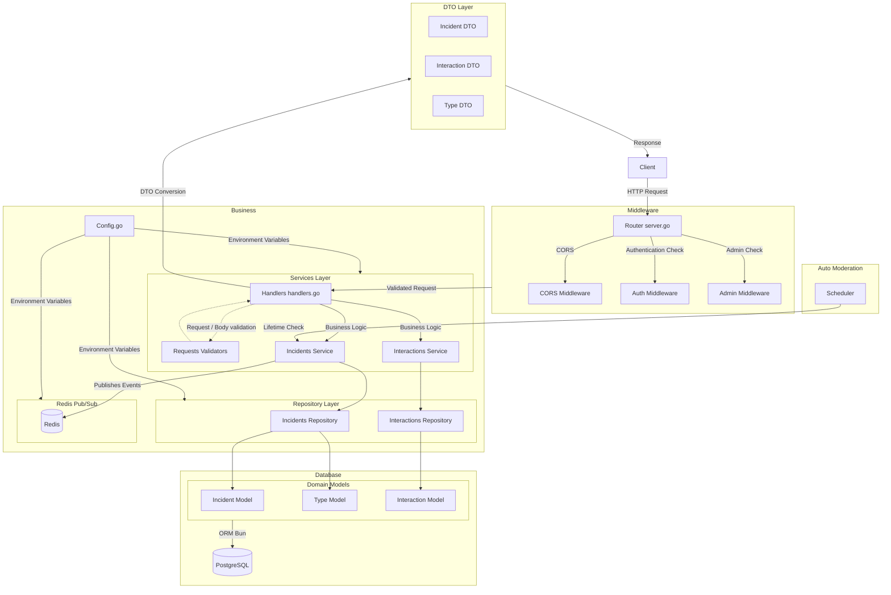

# supmap-users

Microservice de gestion des incidents pour Supmap

## Présentation

**supmap-incidents** est un microservice écrit en Go destiné à la gestion des incidents de navigation pour Supmap.

## Architecture



```
supmap-incidents/
├── cmd/
│   └── api/
│       └── main.go                         # Point d'entrée du microservice
├── internal/
│   ├── api/            
│   │   ├── handlers.go                     # Gestionnaires de requêtes HTTP
│   │   ├── server.go                       # Configuration du serveur HTTP et routes
│   │   ├── middlewares.go                  # Intercepteurs de requête
│   │   └── validations/       
│   │       └── ...                         # Structures de validation
│   ├── config/
│   │   └── config.go                       # Configuration et variables d'environnement
│   ├── models/         
│   │   ├── dto/                            # DTOs permettant d'exposer les données
│   │   └── ...                             # Structures de données pour l'ORM Bun
│   ├── repository/                         # Repository implémentant les requêtes SQL avec l'ORM Bun
│   │   └── ...
│   └── services/                           # Services implémentant les fonctionnalités métier du service
│       ├── ...
│       ├── redis/                        
│       │   ├── redis.go                    # Configuration du client Redis
│       │   └── messages.go                 # Messages envoyés dans le pub/sub
│       └── scheduler/
│           ├── scheduler.go                # Service appelant une fonction à intervalle régulier
│           └── auto-moderate-incidents.go  # Fonctions d'auto modération
├── docs/                                   # Documentation Swagger auto implémentée avec Swggo
│   └── ...
├── Dockerfile                              # Image Docker du microservice
├── go.mod                                  # Dépendances Go
├── go.sum /                                # Checksums des dépendances (auto généré)
└── README.md                               # Documentation du projet
```

## Prérequis et installation

- Go 1.24
- Base de données postgres (conteneurisée ou non)

### Démarrage rapide 

```sh
# Cloner le repo
git clone https://github.com/4PROJ-Le-projet-d-une-vie/supmap-incidents.git
cd supmap-users

# Démarrer le service (nécessite les variables d'environnement, voir ci-dessous)
go run ./cmd/api
```

### Avec Docker

```sh
docker pull ghcr.io/4proj-le-projet-d-une-vie/supmap-incidents:latest
docker run --env-file .env -p 8080:80 supmap-incidents
```

#### Authentification

Pour pull l'image, il faut être authentifié par docker login.

- Générer un Personal Access Token sur GitHub :
    - Se rendre sur https://github.com/settings/tokens
    - Cliquer sur "Generate new token"
    - Cocher au minimum la permission read:packages
    - Copier le token
- Connecter Docker à GHCR avec le token :

```sh
echo 'YOUR_GITHUB_TOKEN' | docker login ghcr.io -u YOUR_GITHUB_USERNAME --password-stdin
```

## Configuration

La configuration se fait via des variables d'environnement ou un fichier `.env` :

|   Variable   | Description                                                                          |
|:------------:|:-------------------------------------------------------------------------------------|
|    `ENV`     | Définit l'environnement dans lequel est exécuté le programme (par défaut production) |
|   `DB_URL`   | URL complète vers la base de donnée                                                  |
|    `PORT`    | Port sur lequel écoutera le service pour recevoir les requêtes                       |
| `JWT_SECRET` | Secret permettant de vérifier l'authenticité d'un token JWT pour l'authentification  |

## Swagger

Chaque handler de ce service comprend des commentaires [Swaggo](https://github.com/swaggo/swag) pour créer dynamiquement une page Swagger-ui.
Exécutez les commande suivantes pour générer la documentation :
```sh
# Installez l'interpréteur de commande Swag
go install github.com/swaggo/swag/cmd/swag@latest

# Générez la documentation
swag init -g cmd/api/main.go
```

Maintenant, vous pouvez accèder à l'URL http://localhost:8080/swagger/index.html décrivant la structure attendue pour chaque endpoint de l'application

> **NB:** La documentation n'inclut pas les endpoints /internal destinés à une utilisation exclusivement interne