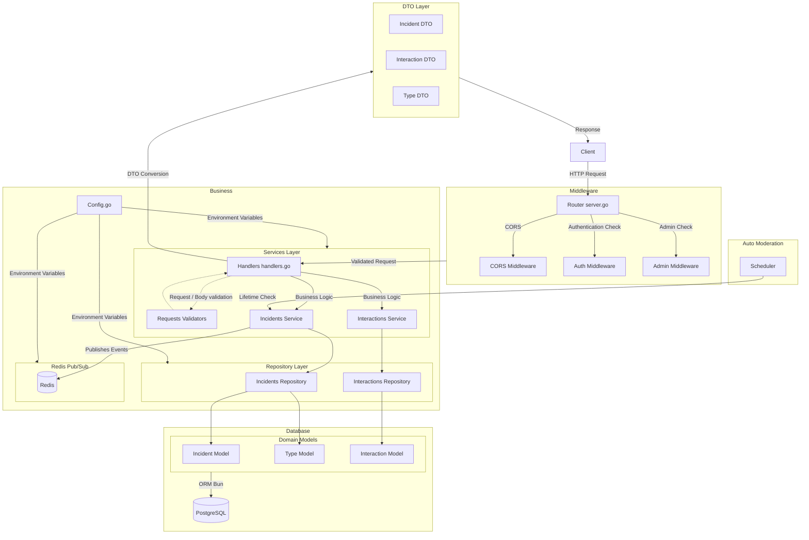

# supmap-incidents

Microservice de gestion des incidents pour Supmap

## Présentation

**supmap-incidents** est un microservice écrit en Go destiné à la gestion des incidents de navigation pour Supmap.

## Architecture



```
supmap-incidents/
├── cmd/
│   └── api/
│       └── main.go                         # Point d'entrée du microservice
├── internal/
│   ├── api/            
│   │   ├── handlers.go                     # Gestionnaires de requêtes HTTP
│   │   ├── server.go                       # Configuration du serveur HTTP et routes
│   │   ├── middlewares.go                  # Intercepteurs de requête
│   │   └── validations/       
│   │       └── ...                         # Structures de validation
│   ├── config/
│   │   └── config.go                       # Configuration et variables d'environnement
│   ├── models/         
│   │   ├── dto/                            # DTOs permettant d'exposer les données
│   │   └── ...                             # Structures de données pour l'ORM Bun
│   ├── repository/                         # Repository implémentant les requêtes SQL avec l'ORM Bun
│   │   └── ...
│   └── services/                           # Services implémentant les fonctionnalités métier du service
│       ├── ...
│       ├── redis/                        
│       │   ├── redis.go                    # Configuration du client Redis
│       │   └── messages.go                 # Messages envoyés dans le pub/sub
│       └── scheduler/
│           ├── scheduler.go                # Service appelant une fonction à intervalle régulier
│           └── auto-moderate-incidents.go  # Fonctions d'auto modération
├── docs/                                   # Documentation Swagger auto implémentée avec Swggo
│   └── ...
├── Dockerfile                              # Image Docker du microservice
├── go.mod                                  # Dépendances Go
├── go.sum /                                # Checksums des dépendances (auto généré)
└── README.md                               # Documentation du projet
```

## Prérequis et installation

- Go 1.24
- Base de données postgres (conteneurisée ou non)

### Démarrage rapide 

```sh
# Cloner le repo
git clone https://github.com/4PROJ-Le-projet-d-une-vie/supmap-incidents.git
cd supmap-incidents

# Démarrer le service (nécessite les variables d'environnement, voir ci-dessous)
go run ./cmd/api
```

### Avec Docker

```sh
docker pull ghcr.io/4proj-le-projet-d-une-vie/supmap-incidents:latest
docker run --env-file .env -p 8080:80 supmap-incidents
```

#### Authentification

Pour pull l'image, il faut être authentifié par docker login.

- Générer un Personal Access Token sur GitHub :
    - Se rendre sur https://github.com/settings/tokens
    - Cliquer sur "Generate new token"
    - Cocher au minimum la permission read:packages
    - Copier le token
- Connecter Docker à GHCR avec le token :

```sh
echo 'YOUR_GITHUB_TOKEN' | docker login ghcr.io -u YOUR_GITHUB_USERNAME --password-stdin
```

## Configuration

La configuration se fait via des variables d'environnement ou un fichier `.env` :

|         Variable          | Description                                                                                  |
|:-------------------------:|:---------------------------------------------------------------------------------------------|
|           `ENV`           | Définit l'environnement dans lequel est exécuté le programme (par défaut production)         |
|         `DB_URL`          | URL complète vers la base de donnée                                                          |
|          `PORT`           | Port sur lequel écoutera le service pour recevoir les requêtes                               |
|    `SUPMAP_USERS_HOST`    | Host du service utilisateur                                                                  |
|    `SUPMAP_USERS_PORT`    | Port du service utilisateur sur la machine host                                              |
|       `REDIS_HOST`        | Host du service redis                                                                        |
|       `REDIS_PORT`        | Port du service redis sur la machine host                                                    |
| `REDIS_INCIDENTS_CHANNEL` | Nom du channel du pub/sub redis dans lequel sont publiés les messages (par défaut incidents) |

## Swagger

Chaque handler de ce service comprend des commentaires [Swaggo](https://github.com/swaggo/swag) pour créer dynamiquement une page Swagger-ui.
Exécutez les commande suivantes pour générer la documentation :
```sh
# Installez l'interpréteur de commande Swag
go install github.com/swaggo/swag/cmd/swag@latest

# Générez la documentation
swag init -g cmd/api/main.go
```

Maintenant, vous pouvez accèder à l'URL http://localhost:8080/swagger/index.html décrivant la structure attendue pour chaque endpoint de l'application

> **NB:** La documentation n'inclut pas les endpoints /internal destinés à une utilisation exclusivement interne

## Authentification

L'authentification dans ce service est entièrement externalisée vers le microservice `supmap-users`.

Lorsqu'une requête authentifiée arrive sur le service, le middleware d'authentification :
1. Récupère le token JWT depuis le header `Authorization`
2. Effectue une requête HTTP vers le endpoint interne `/internal/users/check-auth` du service utilisateurs
3. Vérifie la réponse :
  - Si le token est valide, la requête continue son traitement
  - Si le token est invalide ou expiré, une erreur 401 ou 403 est retournée

Cette approche permet de :
- Centraliser la logique d'authentification dans un seul service
- Garantir la cohérence des vérifications de sécurité
- Simplifier la maintenance en évitant la duplication de code

> **Note:** Les routes `/internal` ne sont accessibles que depuis le réseau interne et ne nécessitent pas d'authentification supplémentaire

## Migrations de base de données

Les migrations permettent de versionner la structure de la base de données et de suivre son évolution au fil du temps.
Elles garantissent que tous les environnements (développement, production, etc.) partagent le même schéma de base de données.

Ce projet utilise [Goose](https://github.com/pressly/goose) pour gérer les migrations SQL. Les fichiers de migration sont stockés dans le dossier `migrations/changelog/` et sont embarqués dans le binaire grâce à la directive `//go:embed` dans [migrate.go](migrations/migrate.go).

### Création d'une migration

Pour créer une nouvelle migration, installez d'abord le CLI Goose :

```sh
go install github.com/pressly/goose/v3/cmd/goose@latest
```

Puis créez une nouvelle migration (la commande se base sur les variables du fichier .env) :
```shell
# Crée une migration vide
goose -dir migrations/changelog create nom_de_la_migration sql

# La commande génère un fichier horodaté dans migrations/changelog/
# Example: 20240315143211_nom_de_la_migration.sql
```

### Exécution des migrations

Les migrations sont exécutées automatiquement au démarrage du service via le package migrations :
```go
// Dans main.go
if err := migrations.Migrate("pgx", conf.DbUrl, logger); err != nil {
    logger.Error("migration failed", "err", err)
}
```

Le package migrations utilise embed.FS pour embarquer les fichiers SQL dans le binaire :
```go
//go:embed changelog/*.sql
var changelog embed.FS
// Connexion à la base de données
goose.SetBaseFS(changelog)
```

## Auto-modération des incidents

Le service intègre un système d'auto-modération asynchrone qui vérifie et nettoie périodiquement les incidents selon des règles métier définies.

### Fonctionnement du scheduler

Le scheduler utilise un `time.Ticker` pour exécuter des tâches de modération à intervalles réguliers de manière asynchrone :

```go
func (s *Scheduler) Run() {
    go func() {
        for {
            select {
            case <-s.ticker.C:  // Channel bloquant qui reçoit un signal à chaque tick
                  s.CheckLifetimeWithoutConfirmation(ctx, tx)
                  s.CheckGlobalLifeTime(ctx, tx)
            case <-s.stop:      // Channel permettant d'arrêter proprement le scheduler
                  s.ticker.Stop()
                  return
            }
        }
    }()
}
```
Le scheduler complet est dans [scheduler.go](internal/services/scheduler/scheduler.go)

Le scheduler est lancé dans une goroutine (`go func()`) pour s'exécuter de manière asynchrone sans bloquer le reste de l'application. Le select attend alors deux types d'événements :
- Un signal du ticker à intervalle régulier pour lancer les vérifications
- Un signal d'arrêt pour terminer proprement le scheduler

### Règles de modération

Deux types de vérifications sont effectuées sur les incidents actifs :

Durée sans confirmation :
```go
noInteractionThreshold := time.Duration(incident.Type.LifetimeWithoutConfirmation)
if time.Since(incident.UpdatedAt) > noInteractionThreshold*time.Second {
    // Suppression de l'incident
}
```
Si un incident n'a reçu aucune interaction pendant une durée définie par son type, il est automatiquement supprimé.

Durée de vie globale :
```go
incidentTTL := time.Duration(incident.Type.GlobalLifetime)
if time.Since(incident.CreatedAt) > incidentTTL*time.Second {
    // Suppression de l'incident
}
```
Chaque type d'incident définit une durée de vie maximale. Une fois cette durée dépassée, l'incident est automatiquement supprimé.

Lorsqu'un incident est supprimé par l'auto-modération, un message est publié dans Redis pour notifier les autres services :
```go
err = s.redis.PublishMessage(s.config.IncidentChannel, &rediss.IncidentMessage{
    Data:   *dto.IncidentToRedis(&incident),
    Action: rediss.Deleted,
})
```

## Communication par Redis Pub/Sub

Redis est utilisé dans ce service comme un système de messagerie en temps réel grâce à son mécanisme de Publish/Subscribe (Pub/Sub). Cette approche permet de notifier les autres services du système lors de changements d'état des incidents.

### Fonctionnement du Pub/Sub Redis

Le Pub/Sub est un pattern de messagerie où les émetteurs (publishers) envoient des messages dans des canaux spécifiques, sans connaissance directe des destinataires. Les récepteurs (subscribers) s'abonnent aux canaux qui les intéressent pour recevoir ces messages.

Dans notre application, nous utilisons ce mécanisme pour publier trois types d'événements :
```go
const (
    Create    Action = "create"    // Nouvel incident créé
    Certified Action = "certified" // Incident certifié par suffisamment d'interactions positives
    Deleted   Action = "deleted"   // Incident supprimé (manuellement ou par auto-modération)
)
```

### Implémentation

Le service utilise un client Redis asynchrone qui publie les messages via un channel Go :
```go
type Redis struct {
    client *redis.Client
    send   chan redis.Message    // Channel pour les messages à envoyer
}

func (r *Redis) Run(ctx context.Context) {
    go r.publisher(ctx)  // Démarre le publisher dans une goroutine
}

func (r *Redis) publisher(ctx context.Context) {
    for {
        select {
        case msg := <-r.send:  // Attend les messages à publier
            err := r.client.Publish(ctx, msg.Channel, msg.Payload).Err()
            if err != nil {
                r.log.Error("redis publish message error", "error", err)
            }
        case <-ctx.Done():     // Arrêt propre lors de la fermeture du service
            return
        }
    }
}
```

### Structure des messages
Les messages publiés suivent une structure commune :

```go
type IncidentMessage struct {
    Data   dto.IncidentRedis `json:"data"`    // Données de l'incident
    Action Action            `json:"action"`   // Type d'action (create/certified/deleted)
}
```

Cette approche permet aux autres services de réagir en temps réel aux changements d'état des incidents, permettant la mise à jour des interfaces utilisateur en cours de navigation.

## Endpoints

Les endpoints ci-dessous sont présentés selon l'ordre dans lequel ils sont définit dans [server.go](internal/api/server.go)

<details>
<summary>GET /incidents</summary>

### GET /incidents

Get endpoint permet de trouver tous les incidents dans un rayon autour d'un point. Il est possible de filtrer par type d'incident.

#### Authentification / Autorisations

Aucune authentification n'est nécessaire, cet endpoint est public.

#### Paramètres / Corp de requête

| Paramètre | Type    | Description                                                                                                                                           |
|-----------|---------|-------------------------------------------------------------------------------------------------------------------------------------------------------|
| lat       | float64 | Latitude du point central de la zone de recherche                                                                                                     |
| lon       | float64 | Longitude du point central de la zone de recherche                                                                                                    |
| radius    | int64   | Rayon en mètres dans lequel seront cherchés les incidents                                                                                             |
| include   | string  | Valeurs possibles :<br/>- interactions (inclut toutes les intéractions de l'incident)<br/>- summary (inclut un résumé des intéractions de l'incident) |

#### Réponse

<details>
<summary>include non définit</summary>

##### include non définit
```json
[
  {
    "id": 0,
    "user": {
      "handle": "string",
      "id": 0,
      "role": {
        "name": "string"
      }
    },
    "type": {
      "id": 0,
      "name": "string",
      "description": "string",
      "need_recalculation": true
    },
    "lat": 0,
    "lon": 0,
    "created_at": "string",
    "deleted_at": "string",
    "updated_at": "string",
    "distance": 0
  },
  ...
]
```
</details>

<details>
<summary>include définit à interactions</summary>

##### include définit à `interactions`
```json
[
  {
    "id": 0,
    "user": {
      "handle": "string",
      "id": 0,
      "role": {
        "name": "string"
      }
    },
    "type": {
      "description": "string",
      "id": 0,
      "name": "string",
      "need_recalculation": true
    },
    "lat": 0,
    "lon": 0,
    "interactions": [
      {
        "id": 0,
        "user": {
          "handle": "string",
          "id": 0,
          "role": {
            "name": "string"
          }
        },
        "is_still_present": true,
        "created_at": "string"
      },
      ...
    ],
    "created_at": "string",
    "updated_at": "string",
    "deleted_at": "string",
    "distance": 0
  },
  ...
]
```
</details>

<details>
<summary>Interactions définit à summary</summary>

##### Interactions définit à `summary`

```json
[
  {
    "id": 0,
    "user": {
      "handle": "string",
      "id": 0,
      "role": {
        "name": "string"
      }
    },
    "type": {
      "description": "string",
      "id": 0,
      "need_recalculation": true,
      "name": "string"
    },
    "lat": 0,
    "lon": 0,
    "interactions_summary": {
      "is_still_present": 0,
      "no_still_present": 0,
      "total": 0
    },
    "created_at": "string",
    "updated_at": "string",
    "deleted_at": "string",
    "distance": 0
  },
  ...
]
```
</details>
   
#### Trace

```
mux.Handle("GET /incidents", s.GetAllInRadius())
└─> func (s *Server) GetAllInRadius() http.HandlerFunc                                                                                                                    # Handler HTTP
    ├─> func (s *Service) FindIncidentsInRadius(ctx context.Context, typeId *int64, lat, lon float64, radius int64) ([]models.IncidentWithDistance, error)                # Service
    │   ├─> func (i *Incidents) FindIncidentTypeById(ctx context.Context, id *int64) (*models.Type, error)                                                                # Repository
    │   ├─> func (i *Incidents) FindIncidentsInZone(ctx context.Context, lat, lon *float64, radius int64, typeId *int64) ([]models.IncidentWithDistance, error)           # Repository
    │   └─> func (i *Incidents) FindIncidentById(ctx context.Context, id int64) (*models.Incident, error)                                                                 # Repository
    │       └─> func (i *Incidents) FindIncidentByIdTx(ctx context.Context, exec bun.IDB, id int64) (*models.Incident, error)                                             # Repository (Inclut une gestion de transactions concurrentes)
    ├─> func IncidentWithDistanceToDTO(incident *models.IncidentWithDistance, interactionsState InteractionsResultState) *IncidentWithDistanceDTO                         # Conversion DTO
    └─> mathdeodrd.handler/func Encode[T any](v T, status int, w http.ResponseWriter) error                                                                               # Ecriture de la réponse avec une fonction générique    
```
</details>

<details>
<summary>GET /incidents/me/history</summary>

### GET /incidents/me/history

Récupère l'historique des incidents créés par l'utilisateur authentifié qui ont été supprimés (auto-modération ou interactions négatives).

#### Authentification / Autorisations
- L'utilisateur doit être authentifié (sinon code http 401)
- Une session valide est requise (sinon code http 403)

#### Paramètres / Corps de requête

| Paramètre | Type   | Description                                                                                                                                           |
|-----------|--------|-------------------------------------------------------------------------------------------------------------------------------------------------------|
| include   | string | Valeurs possibles :<br/>- interactions (inclut toutes les intéractions de l'incident)<br/>- summary (inclut un résumé des intéractions de l'incident) |

#### Réponse

<details>
<summary>include non définit</summary>

##### include non définit
```json
[
  {
    "id": 0,
    "user": {
      "handle": "string",
      "id": 0,
      "role": {
        "name": "string"
      }
    },
    "type": {
      "id": 0,
      "name": "string",
      "description": "string",
      "need_recalculation": true
    },
    "lat": 0,
    "lon": 0,
    "created_at": "string",
    "deleted_at": "string",
    "updated_at": "string",
    "distance": 0
  },
  ...
]
```
</details>

<details>
<summary>include définit à interactions</summary>

##### include définit à `interactions`
```json
[
  {
    "id": 0,
    "user": {
      "handle": "string",
      "id": 0,
      "role": {
        "name": "string"
      }
    },
    "type": {
      "description": "string",
      "id": 0,
      "name": "string",
      "need_recalculation": true
    },
    "lat": 0,
    "lon": 0,
    "interactions": [
      {
        "id": 0,
        "user": {
          "handle": "string",
          "id": 0,
          "role": {
            "name": "string"
          }
        },
        "is_still_present": true,
        "created_at": "string"
      },
      ...
    ],
    "created_at": "string",
    "updated_at": "string",
    "deleted_at": "string",
    "distance": 0
  },
  ...
]
```
</details>

<details>
<summary>Interactions définit à summary</summary>

##### Interactions définit à `summary`

```json
[
  {
    "id": 0,
    "user": {
      "handle": "string",
      "id": 0,
      "role": {
        "name": "string"
      }
    },
    "type": {
      "description": "string",
      "id": 0,
      "need_recalculation": true,
      "name": "string"
    },
    "lat": 0,
    "lon": 0,
    "interactions_summary": {
      "is_still_present": 0,
      "no_still_present": 0,
      "total": 0
    },
    "created_at": "string",
    "updated_at": "string",
    "deleted_at": "string",
    "distance": 0
  },
  ...
]
```
</details>

#### Trace

```
mux.Handle("GET /incidents/me/history", s.AuthMiddleware()(s.GetUserHistory()))
├─> func (s *Server) AuthMiddleware() func(http.Handler) http.Handler                                                       # Authentifie l'utilisateur
│   └─> GET /internal/users/check-auth                                                                                      # Vérification du token par le service users
└─> func (s *Server) GetUserHistory() http.HandlerFunc                                                                      # Handler HTTP
    ├─> func (s *Service) GetUserHistory(ctx context.Context, user *dto.PartialUserDTO) ([]models.Incident, error)          # Service
    │   └─> func (i *Incidents) FindUserHistory(ctx context.Context, user *dto.PartialUserDTO) ([]models.Incident, error)   # Repository
    ├─> func IncidentToDTO(incident *models.Incident, interactionsState InteractionsResultState) *IncidentDTO               # Conversion DTO
    └─> mathdeodrd.handler/func Encode[T any](v T, status int, w http.ResponseWriter) error                                 # Ecriture de la réponse
```
</details>

<details>
<summary>GET /incidents/types</summary>

### GET /incidents/types

Récupère la liste de tous les types d'incidents disponibles dans l'application.

#### Authentification / Autorisations
Aucune authentification requise, endpoint public.

#### Paramètres / Corps de requête
Aucun paramètre requis.

#### Réponse

```json
[
  {
    "id": 0,
    "name": "string",
    "description": "string",
    "need_recalculation": true
  },
  ...
]
```

#### Trace

```
mux.Handle("GET /incidents/types", s.GetIncidentsTypes())
└─> func (s *Server) GetIncidentsTypes() http.HandlerFunc                                               # Handler HTTP
    ├─> func (s *Service) GetAllIncidentTypes(ctx context.Context) ([]models.Type, error)               # Service
    │   └─> func (i *Incidents) FindAllIncidentTypes(ctx context.Context) ([]models.Type, error)        # Repository
    ├─> func TypeToDTO(type *models.Type) *TypeDTO                                                      # Conversion DTO
    └─> mathdeodrd.handler/func Encode[T any](v T, status int, w http.ResponseWriter) error             # Écriture de la réponse
```

### GET /incidents/types/{id}

Récupère les détails d'un type d'incident spécifique par son ID.

#### Authentification / Autorisations
Aucune authentification requise, endpoint public.

#### Paramètres / Corps de requête

| Paramètre | Type  | Description                      |
|-----------|-------|----------------------------------|
| id        | int64 | ID du type d'incident recherché  |

#### Réponse

```json
{
  "id": 0,
  "name": "string",
  "description": "string",
  "need_recalculation": true
}
```

#### Trace

```
mux.Handle("GET /incidents/types/{id}", s.GetIncidentTypeById())
└─> func (s *Server) GetIncidentTypeById() http.HandlerFunc                                                 # Handler HTTP
    ├─> func (s *Service) FindTypeById(ctx context.Context, id int64) (*models.Type, error)                 # Service
    │   └─> func (i *Incidents) FindIncidentTypeById(ctx context.Context, id *int64) (*models.Type, error)  # Repository
    ├─> func TypeToDTO(type *models.Type) *TypeDTO                                                          # Conversion DTO
    └─> mathdeodrd.handler/func Encode[T any](v T, status int, w http.ResponseWriter) error                 # Ecriture de la réponse
```
</details>

<details>
<summary>POST /incidents</summary>

### POST /incidents

Crée un nouvel incident ou ajoute une interaction positive à un incident existant si un incident similaire existe déjà dans un rayon de 100m.

#### Authentification / Autorisations
- L'utilisateur doit être authentifié (sinon code http 401)
- Une session valide est requise (sinon code http 403)
- Un utilisateur ne peut pas créer plus d'un incident par minute (code http 429)

#### Paramètres / Corps de requête

```json
{
  "type_id": 0,
  "lat": 0,
  "lon": 0
}
```

Règles de validation :

- type_id : ID d'un type d'incident existant
- lat : Latitude entre -90 et 90
- lon : Longitude entre -180 et 180

#### Réponse

```json
{
  "id": 0,
  "user": {
    "handle": "string",
    "id": 0,
    "role": {
      "name": "string"
    }
  },
  "type": {
    "description": "string",
    "id": 0,
    "name": "string",
    "need_recalculation": true
  },
  "lat": 0,
  "lon": 0,
  "created_at": "string",
  "updated_at": "string",
  "deleted_at": "string"
}
```

#### Trace

```
mux.Handle("POST /incidents", s.AuthMiddleware()(s.CreateIncident()))
├─> func (s *Server) AuthMiddleware() func(http.Handler) http.Handler                                                                                             # Authentifie l'utilisateur 
│   └─> GET /internal/users/check-auth                                                                                                                            # Vérification du token par le service users
└─> func (s *Server) CreateIncident() http.HandlerFunc                                                                                                            # Handler HTTP
    ├─> func (s *Service) CreateIncident(ctx context.Context, user *dto.PartialUserDTO, body *validations.CreateIncidentValidator) (*models.Incident, error)      # Service
    │   ├─> func (i *Incidents) FindIncidentTypeById(ctx context.Context, id *int64) (*models.Type, error)                                                        # Repository
    │   ├─> func (i *Incidents) GetLastUserIncident(ctx context.Context, user *dto.PartialUserDTO) (*models.Incident, error)                                      # Repository
    │   ├─> func (i *Incidents) FindIncidentsInZone(ctx context.Context, lat, lon *float64, radius int64, typeId *int64) ([]models.IncidentWithDistance, error)   # Repository
    │   ├─> func (i *Incidents) FindIncidentById(ctx context.Context, id int64) (*models.Incident, error)                                                         # Repository
    │   ├─> func (i *Incidents) CreateIncident(ctx context.Context, incident *models.Incident) error                                                              # Repository (Inclut une gestion de transactions concurrentes) 
    │   └─> func (r *Redis) PublishMessage(channel string, payload any) error                                                                                     # Publication de l'événement Redis
    ├─> func IncidentToDTO(incident *models.Incident, interactionsState InteractionsResultState) *IncidentDTO                                                     # Conversion DTO
    └─> mathdeodrd.handler/func Encode[T any](v T, status int, w http.ResponseWriter) error                                                                       # Ecriture de la réponse
```
</details>

<details>
<summary>POST /incidents/interactions</summary>

### POST /incidents/interactions

Permet à un utilisateur d'interagir avec un incident existant en confirmant ou infirmant sa présence.

#### Authentification / Autorisations

- L'utilisateur doit être authentifié (sinon code http 401)
- Une session valide est requise (sinon code http 403)
- Un utilisateur ne peut pas interagir avec son propre incident (code http 403)
- Un utilisateur ne peut pas interagir plus d'une fois par heure avec le même incident (code http 429)

#### Paramètres / Corps de requête

```json
{
  "incident_id": 0,
  "is_still_present": true
}
```

Règles de validation :

- incident_id : ID d'un incident existant
- is_still_present : Booléen indiquant si l'incident est toujours présent

#### Réponse

<details>
<summary>include non définit</summary>

##### include non définit
```json
{
  "id": 0,
  "user": {
    "handle": "string",
    "id": 0,
    "role": {
      "name": "string"
    }
  },
  "incident": {
    "id": 0,
    "user": {
      "handle": "string",
      "id": 0,
      "role": {
        "name": "string"
      }
    },
    "type": {
      "description": "string",
      "id": 0,
      "name": "string",
      "need_recalculation": true
    },
    "lat": 0,
    "lon": 0,
    "created_at": "string",
    "updated_at": "string",
    "deleted_at": "string"
  },
  "created_at": "string",
  "is_still_present": true
}
```
</details>

<details>
<summary>include définit à interactions</summary>

##### include définit à `interactions`
```json
{
  "id": 0,
  "user": {
    "handle": "string",
    "id": 0,
    "role": {
      "name": "string"
    }
  },
  "incident": {
    "id": 0,
    "user": {
      "handle": "string",
      "id": 0,
      "role": {
        "name": "string"
      }
    },
    "type": {
      "description": "string",
      "id": 0,
      "name": "string",
      "need_recalculation": true
    },
    "lat": 0,
    "lon": 0,
    "interactions": [
      "string"
    ],
    "created_at": "string",
    "updated_at": "string",
    "deleted_at": "string"
  },
  "created_at": "string",
  "is_still_present": true
}
```
</details>

<details>
<summary>Interactions définit à summary</summary>

##### Interactions définit à `summary`

```json
{
  "id": 0,
  "user": {
    "handle": "string",
    "id": 0,
    "role": {
      "name": "string"
    }
  },
  "incident": {
    "id": 0,
    "user": {
      "handle": "string",
      "id": 0,
      "role": {
        "name": "string"
      }
    },
    "type": {
      "description": "string",
      "id": 0,
      "name": "string",
      "need_recalculation": true
    },
    "lat": 0,
    "lon": 0,
    "interactions_summary": {
      "is_still_present": 0,
      "no_still_present": 0,
      "total": 0
    },
    "created_at": "string",
    "updated_at": "string",
    "deleted_at": "string"
  },
  "created_at": "string",
  "is_still_present": true
}
```
</details>

#### Trace

```
mux.Handle("POST /incidents/interactions", s.AuthMiddleware()(s.UserInteractWithIncident()))
├─> func (s *Server) AuthMiddleware() func(http.Handler) http.Handler                                                                                                   # Authentifie l'utilisateur 
│   └─> GET /internal/users/check-auth                                                                                                                                  # Vérification du token par le service users
└─> func (s *Server) UserInteractWithIncident() http.HandlerFunc                                                                                                        # Handler HTTP
    ├─> func (s *Service) CreateInteraction(ctx context.Context, user *dto.PartialUserDTO, body *validations.CreateInteractionValidator) (*models.Interaction, error)   # Service
    │   ├─> func (i *Incidents) FindIncidentByIdTx(ctx context.Context, tx bun.IDB, id int64) (*models.Incident, error)                                                 # Repository avec transaction
    │   ├─> func (i *Interactions) InsertTx(ctx context.Context, exec bun.IDB, interaction *models.Interaction) error                                                   # Repository avec transaction
    │   ├─> func (i *Incidents) UpdateIncidentTx(ctx context.Context, exec bun.IDB, incident *models.Incident) error                                                    # Repository avec transaction
    │   ├─> func (i *Interactions) FindInteractionByIdTx(ctx context.Context, exec bun.IDB, id int64) (*models.Interaction, error)                                      # Repository avec transaction
    │   └─> func (r *Redis) PublishMessage(channel string, payload any) error                                                                                           # Publication de l'événement Redis
    ├─> func InteractionToDTO(interaction models.Interaction, interactionsState InteractionsResultState) *InteractionDTO                                                # Conversion DTO
    └─> mathdeodrd.handler/func Encode[T any](v T, status int, w http.ResponseWriter) error                                                                             # Ecriture de la réponse
```
</details>